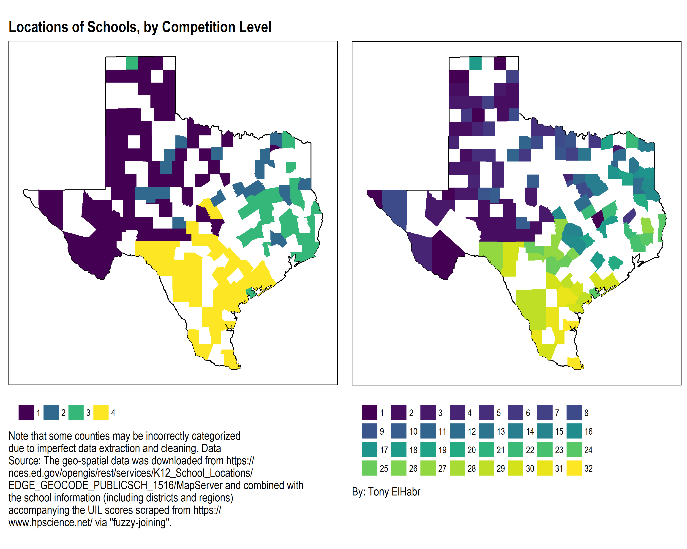
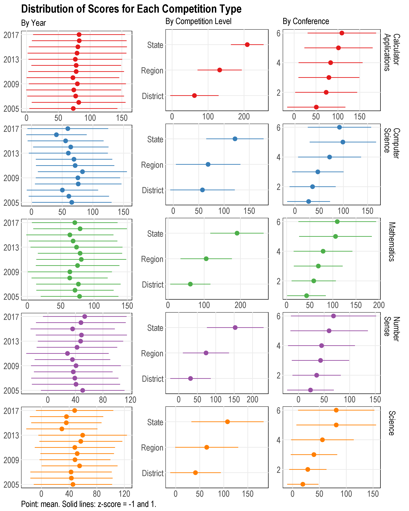
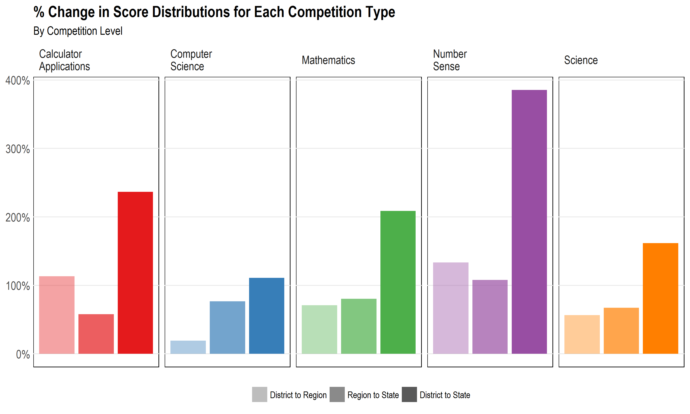
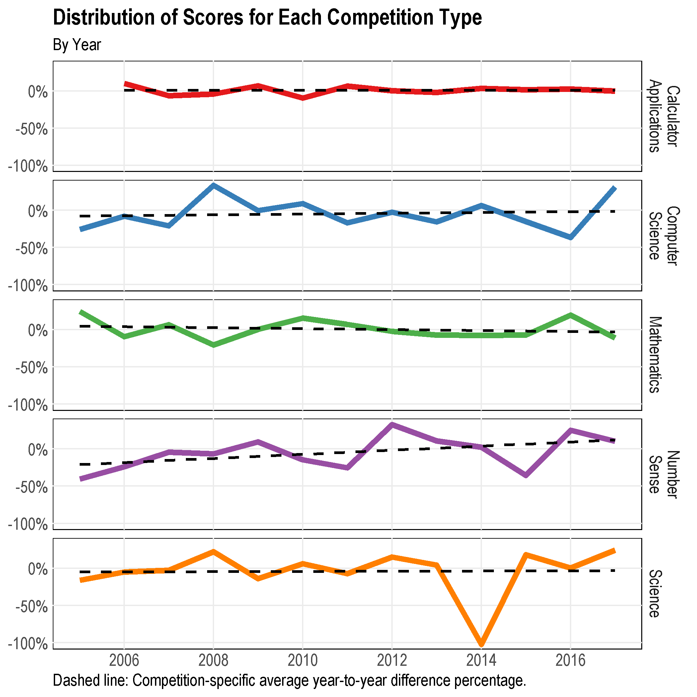
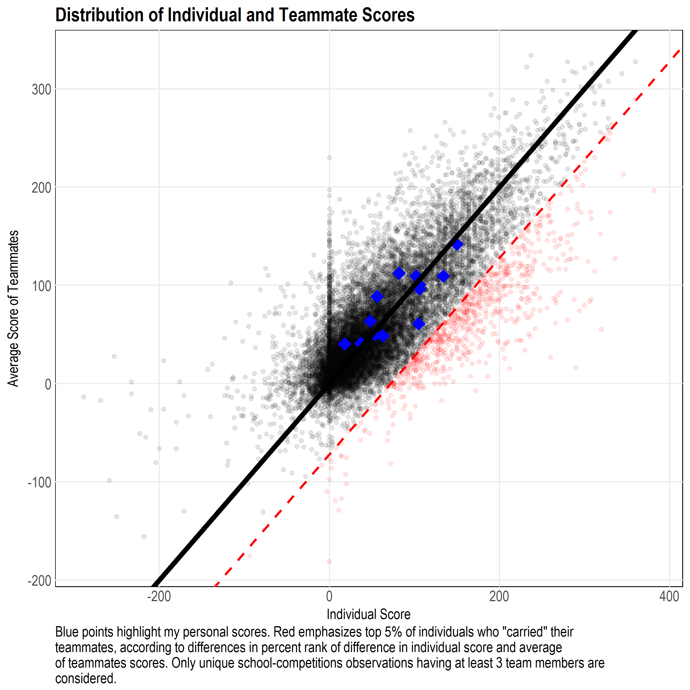
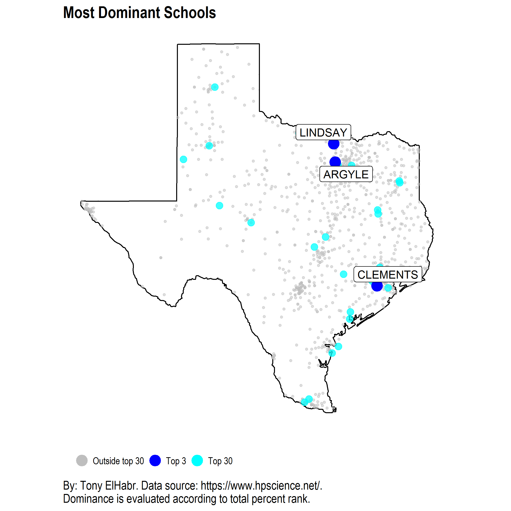

# Introduction

See my blog posts (to be linked here)
for the full write-ups, or, check out the files in the `output/` directory
in this repo, which was used as the basis for the blog post.
The `figs/` directory also contains some of the visualizations in the post.

The documents can be recreated with the following commands.

```{r render, eval = FALSE}
paths <-
  list.files(
    path = "R",
    pattern = "Rmd$",
    full.names = TRUE
  )
purrr::walk(
  paths,
  ~rmarkdown::render(
    input = .x,
    # envir = new.env()
    output_format = "md_document",
    output_dir = "output", 
    intermediates_dir = "output"
  )
)

```

# Highlights

Here are a couple of the coolest visualizations, in my opinion.














